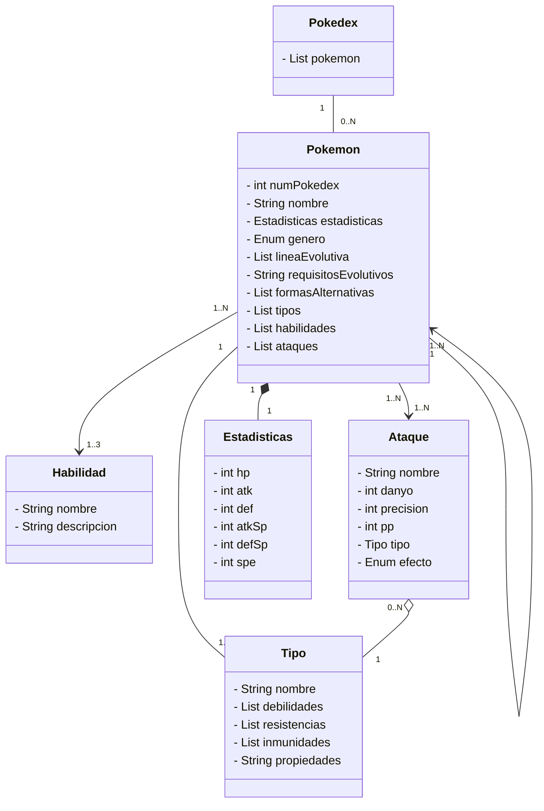

```mermaid
classDiagram

Pokedex "1" -- "0..N" Pokemon
Pokemon "1" -- "1..2" Tipo
Pokemon "1" --> "1..N" Pokemon
Pokemon "1..N" --> "1..3" Habilidad
Pokemon "1..N" --> "1..N" Ataque
Pokemon "1" *-- "1" Estadisticas
Ataque "0..N" o-- "1" Tipo

class Pokedex {
    - List <Pokemon> pokemon
}
class Pokemon {
    - int numPokedex
    - String nombre
    - Estadisticas estadisticas
    - Enum genero
    - List <Pokemon> lineaEvolutiva
    - String requisitosEvolutivos
    - List <Pokemon> formasAlternativas
    - List <Tipo> tipos
    - List <Habilidade> habilidades
    - List <Ataque> ataques
}

class Tipo {
    - String nombre
    - List <Tipo> debilidades
    - List <Tipo> resistencias
    - List <Tipo> inmunidades
    - String propiedades
}

class Habilidad {
    - String nombre
    - String descripcion
}

class Ataque {
    - String nombre
    - int danyo
    - int precision
    - int pp
    - Tipo tipo
    - Enum efecto
}

class Estadisticas {
    - int hp
    - int atk
    - int def
    - int atkSp
    - int defSp
    - int spe
}
```